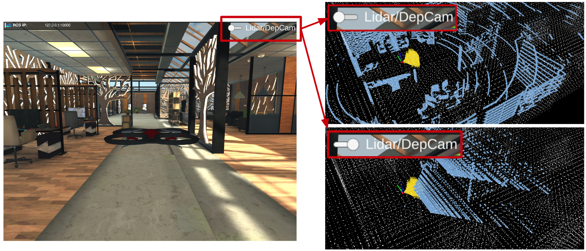

# Aerial Autonomy Development Environment

The environment is meant for leveraging system development and robot deployment for autonomous ground and aerial navigation. Integrating Gazebo and Unity simulators and containing autonomous navigation modules such as collision avoidance, waypoint following, and assistive teleoperation, users can develop autonomous navigation systems and later on deploy to real flying robots with minor sim-to-real gap.

# 7-Minutes Quick Start

The repository has been tested in Ubuntu 20.04 with [ROS Noetic](http://wiki.ros.org/noetic/Installation).  Install dependencies with command below.

```bash
sudo apt install libusb-dev python-yaml python-is-python3 # may need 'sudo apt update' first
git clone https://github.com/Bottle101/aerial_autonomy_development_environment.git

# in a terminal, go to the folder and compile.
cd aerial_autonomy_development_environment
unzip ./src/local_planner/paths/path_files.zip -d ./src/local_planner/paths
catkin_make
```

Download `'factory'` of our [Unity environment models](https://drive.google.com/drive/folders/1za2riVJKV5-InhgOpAdsK-Ug-bUCyeUO?usp=drive_link) and unzip the files to the `'src/vehicle_simulator/mesh'` folder. 

```bash
# launch
source ./devel/setup.bash  
roslaunch vehicle_simulator system_unity.launch  
```

Now, users can send a waypoint by 3 step: 1. click the 'Waypoint3D' button in RVIZ; 2. click a point in the map, hold the left mouse button and scroll the mouse wheel to adjust the altitude;  3. release the mouse.  Users can also use virtual joystick in the left side to achieve assistive teleoperation.


**(Optional)** If you want to use **Gazebo**, please do the following steps:

```bash
# run a script to download environment models for Gazebo
./src/vehicle_simulator/mesh/download_environments.sh

# launch
source ./devel/setup.bash 
roslaunch vehicle_simulator system_gazebo.launch
```

## Change Environments
For Unity, change the **Line 4** in `src/vehicle_simulator/launch/system_unity.launch`

```bash
<arg name="map_name" default="SCENE_TO_USE"/>
# factory, village, urban_city, town, old_town, office_building_1, office_building_2
```
If you are using Gazebo, change `src/vehicle_simulator/launch/system_gazebo.launch`, change the `Line 3 `:

```bash
<arg name="map_name" default="SCENE_TO_USE"/> 
# garage, indoor, campus, tunnel, forest
```

## Sensor Setup
For Unity, we provide both **Lidar** and **Depth Camera** for navigation, we also provide a panoramic RGB camera with semantic segmentation for other tasks. To switch between lidar and depth camera, users can simply click the toggle switch on the upper-right side of the simulator. 

<p align="center">
  
</p>

For Gazebo, due to the time synchronization issue, currently we only support Lidar for locolization and mapping, but you could still use images from the depth camera for CV tasks by subscribing `/rgbd_camera/depth/points`.

## Change Config

Change the **Line 5** in `src/vehicle_simulator/launch/system_unity.launch` or `src/vehicle_simulator/launch/system_gazebo.launch`

```bash
  <arg name="config" default="CONFIG"/> # indoor or outdoor
```
